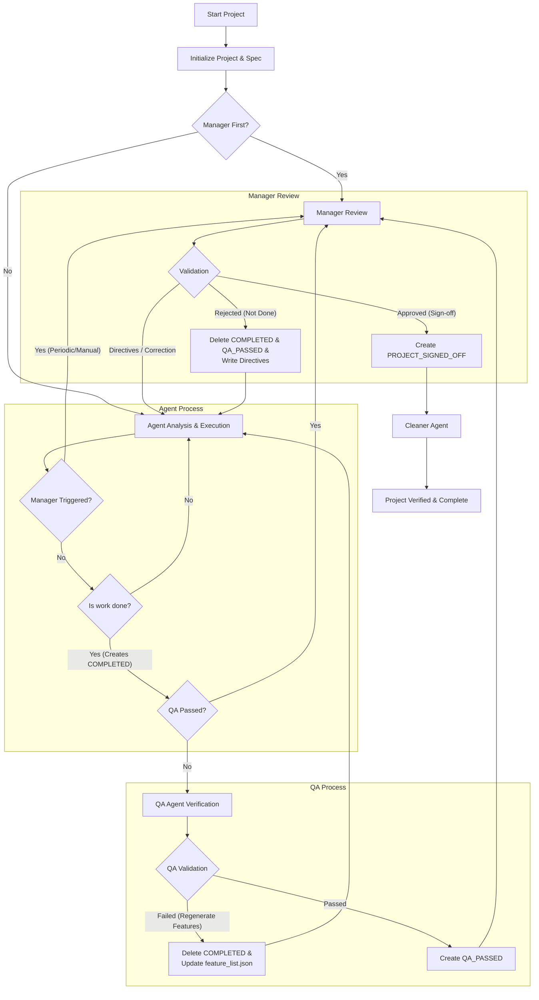

# ⚠️ DEPRECATION NOTICE ⚠️

# THIS REPOSITORY HAS BEEN REPLACED

**Please switch to [https://github.com/process-failed-successfully/recac](https://github.com/process-failed-successfully/recac) to take advantage of Go CLI and TUI libraries.**

**Going forward, this repository will be maintained by agentic AI.**

---

# Combined Autonomous Coding Agent

[](https://github.com/process-failed-successfully/combined-autonomous-coding/actions/workflows/ci.yml)

This project provides a unified interface for running autonomous coding agents using either the **Gemini CLI** or the **Cursor Agent**. It runs securely within a Docker container to ensure isolation and safety.

## 🚀 Quick Start

1.  **Prerequisites**: Ensure you have [Docker](https://www.docker.com/) and `docker compose` installed.
2.  **Prepare your spec**: Create a file named `app_spec.txt` in your current directory describing the application you want to build.

### Running with Default Settings (Gemini)

```bash
./bin/start_agent --spec app_spec.txt
```

This will:

- Build the Docker container (if needed).
- Mount your current directory as the project workspace.
- Start the **Gemini** agent to build the app described in `app_spec.txt`.

## 🤖 Selecting an Agent

You can choose between the `gemini` (default) and `cursor` agents using the `--agent` flag.

### Using Gemini Agent

```bash
./bin/start_agent --agent gemini --spec app_spec.txt
```

### Using Cursor Agent

```bash
./bin/start_agent --agent cursor --spec app_spec.txt
```

### 🏃 Sprint Mode (Concurrent)

For complex projects, you can run multiple agents concurrently. This mode continuously runs cycles of planning and execution until all features are complete.

1.  **Planning Phase**: The **Lead Agent** reads the `feature_list.json` (or checks `app_spec.txt` if new) and creates a Sprint Plan with independent tasks.
2.  **Execution Phase**: **Worker Agents** execute the planned tasks in parallel.
3.  **Loop**: This cycle repeats until the Lead Agent determines that all features are implemented.

**Prerequisite**: For complex projects, place a `feature_list.json` in your project root to define the features the agents should tackle.

```bash
./bin/start_agent --sprint --max-agents 3 --spec app_spec.txt
```

## 🎟️ Jira Integration

You can drive the agent directly from Jira tickets instead of a local spec file.

### Prerequisites

Configure Jira access via `agent_config.yaml` or environment variables:

```bash
export JIRA_URL="https://your-domain.atlassian.net"
export JIRA_EMAIL="your@email.com"
export JIRA_TOKEN="your-api-token"
```

### Running by Ticket ID

```bash
./bin/start_agent --jira-ticket PROJ-123
```

### Running by Label

Picks the first "To Do" ticket with the label:

```bash
./bin/start_agent --jira-label "agent-work"
```

## ⚙️ Common Options

The `start_agent` script passes arguments directly to the agent runner. Here are the most useful options:

| Flag                       | Description                                                                 | Default                 |
| :------------------------- | :-------------------------------------------------------------------------- | :---------------------- |
| `--agent [gemini\|cursor]` | Select the AI agent to use.                                                 | `gemini`                |
| `--spec [path]`            | Path to your application specification file. Required for new projects.     | `app_spec.txt`          |
| `--project-dir [path]`     | Target directory for the project.                                           | Current Directory (`.`) |
| `--model [name]`           | Override the default model (e.g., `gemini-1.5-pro` or `claude-3-5-sonnet`). | `auto`                  |
| `--max-iterations [N]`     | Limit the number of agent loops.                                            | Unlimited               |
| `--no-stream`              | **Disable** real-time streaming output (useful for logs).                   | Streaming Enabled       |
| `--verbose`                | Enable debug logging.                                                       | `False`                 |
| `--manager-frequency [N]`  | How often the Manager Agent runs (in iterations).                           | `10`                    |
| `--manager-first`          | Run the Manager Agent _before_ the first coding session.                    | `False`                 |
| `--jira-ticket [ID]`       | Use a Jira ticket as the work spec (e.g., `PROJ-123`).                      | None                    |
| `--jira-label [Label]`     | Find and pick first 'To Do' ticket with this label.                         | None                    |

### Example: Custom Project Directory and Model

```bash
./bin/start_agent \
  --agent cursor \
  --project-dir ./my-new-app \
  --spec ./specs/todo-app.txt \
  --model claude-3-5-sonnet \
  --max-iterations 20 \
  --manager-first
```

## 🔔 Notifications

You can configure the agent to send notifications to **Slack** and **Discord** for key events (Iteration, Manager updates, Human-in-the-loop, Completion, Errors).

### Configuration

The agent looks for configuration in the following order:

1.  Current Directory: `./agent_config.yaml`
2.  XDG Config Home: `~/.config/combined-autonomous-coding/agent_config.yaml` (Linux/Mac) or `%LOCALAPPDATA%\combined-autonomous-coding\agent_config.yaml` (Windows)
3.  Legacy Path: `~/.gemini/agent_config.yaml`

Create a file named `agent_config.yaml` in any of these locations.

```yaml
# Webhook URLs
slack_webhook_url: "https://hooks.slack.com/services/YOUR/WEBHOOK/URL"
discord_webhook_url: "https://discord.com/api/webhooks/YOUR/WEBHOOK/URL"

# Notification Preferences
notification_settings:
  iteration: false # Summary of every iteration
  manager: true # Manager agent updates (Recommended)
  human_in_loop: true # When human intervention is requested (Recommended)
  project_completion: true # When the project is signed off (Recommended)
  sprint_start: true # When valid sprint plan is created
  sprint_complete: true # When sprint cycle finishes
  error: true # On agent errors or crashes
```

## 🛠️ Development & Troubleshooting

- **Rebuild Container**: If you modify the agent code, force a rebuild:
  ```bash
  ./bin/start_agent --build ...
  ```
- **Git Issues**: The container is configured to handle git ownership issues automatically.
- **Streaming**: By default, the agent streams its "thought process" capability. Use `--no-stream` if you prefer a cleaner, buffered output.

## 🧪 Quality Assurance & CI

This repository uses **GitHub Actions** for robust Continuous Integration.

### Local Testing

You can run the same checks locally using the test script:

```bash
./run_tests.sh
```

This runs:

1. **Flake8** (Linting)
2. **Mypy** (Type Checking)
3. **Bandit** (Security Scan)
4. **Unit Tests**

### Automated Checks

On every push and PR, the CI pipeline performs:

- Python checks (Lint, Type, Security, Test)
- Docker Build verification
- **Trivy** Container Security Scanning

## 🔄 Process Workflow

The system follows a rigorous **"Agent-QA-Manager"** workflow to ensure high-quality output. The QA agent verifies the work before the Manager provides the final sign-off.



### 🧐 QA Agent (Verification)

The **QA Agent** is the first gatekeeper after development is marked as complete.

1.  **Verification**: It strictly verifies that the application runs and all features in `feature_list.json` pass.
2.  **Spec Compliance**: It ensures the output matches the `app_spec.txt`.
3.  **Failure Handling**: If verification fails, it deletes the `COMPLETED` file, regenerates the `feature_list.json` to include failing items, and provides feedback to the coding agent.
4.  **Signal Success**: Once passed, it creates a `QA_PASSED` file, which allows the Manager to perform the final review.

### 🏛️ Manager Triggers

The Manager Agent is now primarily focused on strategic guidance and final high-level sign-off:

1.  **Periodic Review**: Automatically runs every **X iterations** (configurable) to check progress, answer questions, and unblock the coding agent.
2.  **Manual Trigger**: The coding agent can explicitly request a review if it gets stuck.
3.  **Final Sign-off**: After the QA Agent has created a `QA_PASSED` file, the Manager performs a final quality review and signs off (`PROJECT_SIGNED_OFF`).

### 🧹 Cleaner Agent

Once the project is signed off, the **Cleaner Agent** runs to remove temporary files and artifacts, ensuring a clean repository state.

## 🏗️ Architecture

- **`main.py`**: Entry point that dispatches to the selected agent.
- **`agents/`**: Contains the logic for `gemini` and `cursor` agents.
- **`shared/`**: Common utilities (logging, config, file ops) shared between agents.
- **`Dockerfile`**: Defines the secure execution environment with necessary tools (`git`, `node`, `python`, `chromium` for browser tests).

## 🙏 Acknowledgements

This repository is based on and inspired by the [Anthropic Autonomous Coding Quickstart](https://github.com/anthropics/claude-quickstarts/tree/main/autonomous-coding).
